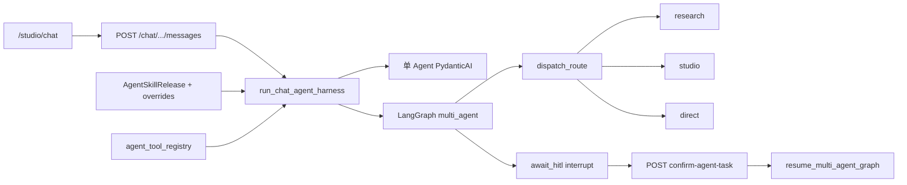

# Agent / Chat 多 Agent 开发留档（冷启动）

Last updated: **2026-07-03**（正文快照）  
**现状索引（必读）**：`docs/archive/handoff-2026-07-16-agent-wip-status.md`（2026-07-16：已推远端分支、仍未合 `main`/生产）

状态（历史表述，已被上条索引覆盖）：曾写「本地 WIP 未 commit」→ 实际已 commit 为 **`4b0a5b3`** @ `wip/agent-multi-chat-2026-07`，**仍未部署生产**。  
文内「生产基线 v1.1.0 @ `0090a2a`」已过时；当前生产见 `docs/continuity.md`（`186b127`）。

> **新对话请先读**：`docs/handoff.md` → **`handoff-2026-07-16-agent-wip-status.md`** → 本文（架构/文件表）→ `docs/product-boundary.md`

---

## 1. 一句话现状

Web Chat（`/studio/chat`）已从「纯 LLM 对话」扩展到 **B1 只读 tools + gov 策略 + 多 Agent LangGraph + HITL 生图确认 + 外网抓取 C1/C2 + ref-intent MVP**；代码已提交为 **`4b0a5b3`** @ `wip/agent-multi-chat-2026-07`（约 +1.2 万行），**仍未合入 `main` / 未部署生产**。现状以 `handoff-2026-07-16-agent-wip-status.md` 为准。

---

## 2. 任务完成度（对照 `docs/tasks.md`）

| Task ID | 状态 | 要点 |
| --- | --- | --- |
| `chat-004` B1 | DONE 本地 | `agent_mode` + 只读 tools + SSE thinking/tool_calls |
| `agent-gov-001` | gov-001a/b/c MVP DONE 本地 | release + override + Admin 可观测 |
| `chat-b2-001` | DONE 本地 | Chat 写 task + HITL 确认卡片 |
| `agent-multi-001` | DONE 本地 | LangGraph trio + personas + PG 记忆表 |
| `agent-multi-002` | DONE 本地 | Harness 统一 + 打分路由 + memory compaction |
| `agent-multi-003` | DONE 本地 | interrupt/resume + PG checkpoint + Meili 记忆 |
| `crawl-001` | C1+C2 DONE；C3 TODO | fetch/import reference page |
| `ref-intent-001` | MVP DONE 本地 | 文本/路径混合检索 |
| `chat-003` | PARTIAL | Markdown、smoke、模型 fallback |

**产品确认顺序（文档约定）**：gov → B2 → multi-agent → ref-intent；实际开发已并行超前，部署时需 **migration + Meili 可选**。

---

## 3. 架构速览



- **单 Agent 路径**：roster < 2 或关闭 multi 时，`chat_agent_service` + PydanticAI tools。
- **多 Agent 路径**：`multi_agent_runner.run_multi_agent_chat_isolated` → `graph.py` 编译图 + checkpointer。
- **写 task**：`chat_agent_task_service`；有 proposal 时 graph interrupt，前端 `ChatTaskProposalCard` → `confirm-agent-task`。

---

## 4. 关键文件（按层）

### Backend — 入口与路由

| 文件 | 职责 |
| --- | --- |
| `backend/app/routers/chat.py` | messages SSE、`agent_mode`、agent-policy、confirm-agent-task |
| `backend/app/routers/agent.py` | Admin personas、policy overrides、chat observability |
| `backend/app/routers/crawl.py` | `POST /crawl/import`、`import-batch` |
| `backend/app/routers/ref_intent.py` | `POST /ref-intent/match` |

### Backend — 服务层

| 文件 | 职责 |
| --- | --- |
| `agent_harness_service.py` | **统一 Harness** `run_chat_agent_harness()` |
| `agent_routing_service.py` | `resolve_route()`、`research_then_studio` |
| `agent_persona_service.py` | 默认 trio、`load_user_agent_roster()` |
| `agent_policy_service.py` | effective policy = release + group + user override |
| `agent_memory_service.py` | PG 记忆 CRUD + compaction |
| `agent_tool_registry_service.py` | allowlist 内 tool 排序 |
| `chat_agent_service.py` | 单 Agent PydanticAI |
| `chat_agent_task_service.py` | Chat → persisted task |
| `multi_agent_runner.py` | graph invoke / resume / audit |
| `crawl_ingest_service.py` | 域名 allowlist、去重入库 |
| `ref_intent_service.py` | 灵感+模板混合检索 |
| `reference_page_service.py` | SSRF-safe 页面抓取 |

### Backend — LangGraph

| 文件 | 职责 |
| --- | --- |
| `integrations/multi_agent/graph.py` | 图定义；路由节点名 **`dispatch_route`**（避免与 state `route` 冲突） |
| `integrations/multi_agent/nodes.py` | 各节点实现 |
| `integrations/multi_agent/checkpoint.py` | Postgres `PostgresSaver`；SQLite 回退 `MemorySaver` |
| `integrations/multi_agent/state.py` | `MultiAgentState` |

### Backend — 搜索 / 记忆

| 文件 | 职责 |
| --- | --- |
| `integrations/search/agent_memory_index.py` | Meilisearch `qmdh_agent_memory` |
| `main.py` lifespan | `ensure_agent_memory_index()` — Meili 不可达时 **warning 降级**，不阻断启动 |

### Frontend — Chat Agent UX

| 文件 | 职责 |
| --- | --- |
| `pages/chat/ChatPage.tsx` | 主页面、bootstrap、agent toggle |
| `ChatAgentThinkingPanel.tsx` | thinking / waiting(HITL) |
| `ChatToolCallList.tsx` | tool 卡片 |
| `ChatTaskProposalCard.tsx` | 生图确认 |
| `ChatAgentCapabilitiesDrawer.tsx` | 「我的助手能力」 |
| `lib/chat/qmdhChatTransport.ts` | SSE + agent_mode |

### Frontend — Admin

| 文件 | 职责 |
| --- | --- |
| `pages/admin/AgentOpsPage.tsx` | release 编辑、overrides、多 Agent 编制 |
| `AgentOpsChatObservabilityPanel.tsx` | gov-001c 只读 traces |
| `AgentPolicyOverridesPanel.tsx` | 组/用户 override |
| `AgentMultiAgentPanel.tsx` | persona 编制 |

---

## 5. 数据库 Migration（部署必跑）

顺序（在 `0090a2a` 的 `g8h9i0j1k2l3` 之后）：

| Revision | 内容 |
| --- | --- |
| `h9i0j1k2l3m4` | AgentSkillRelease chat policy 字段 |
| `i0j1k2l3m4n5` | `agent_policy_overrides` |
| `j0k1l2m3n4o5` | `agent_personas`、`user_agent_assignments`、`agent_memory_entries`、**`conversations.agent_thread_id`** |

```bash
cd backend
python -m alembic upgrade head
```

**本地踩坑（2026-07-03）**：若 Alembic 版本落后但表已部分存在，`upgrade` 可能在 `usage_ledgers` 处失败；Chat 列表 500 的根因是缺 **`conversations.agent_thread_id`**。修复：补列 + `alembic stamp j0k1l2m3n4o5`（详见当次会话）。

---

## 6. 配置与环境变量

| 变量 | 说明 |
| --- | --- |
| `QMDH_MEILISEARCH_ENABLED` | `true` 时需 Meili 可达；否则设 `false` 或依赖降级 |
| `QMDH_CRAWL_ALLOWED_DOMAINS` | crawl C2 域名 allowlist |
| `QMDH_MULTI_AGENT_*` | 见 `backend/.env.example` 新增项 |

本地 dev：`start-dev.cmd` → 18080 / 18010；登录默认 `admin` / `dev-admin-password`（`name` 字段登录）。

---

## 7. 测试命令

```bash
cd backend
python -m pytest tests/test_chat_agent_service.py tests/test_chat_agent_mode.py tests/test_multi_agent_graph_hitl.py -q
python -m pytest tests/test_agent_persona_service.py tests/test_agent_routing_service.py tests/test_agent_policy_service.py -q
python -m pytest tests/test_crawl_ingest_service.py tests/test_ref_intent_service.py -q

cd ../frontend
npm run build
npm run smoke:chat
```

---

## 8. 定价 WIP（同工作区，未部署）

`backend/app/services/haodeya_pricing.py` 已按 2026-07-03 合同更新（GPT 1K/2K、Gemini 1K/2K、Grok 5s/10s）；`sync_haodeya_pricing` 会写 `adapter_config.unit_price_1k/2k`。**生产需 deploy 后**：

```bash
docker compose run --rm backend python -m app.cli sync_haodeya_pricing
```

---

## 9. 生产热补丁三件套（2026-07-01，**已上服务器**）

详 **`docs/archive/haodeya-image-model-routing-2026-07.md` §5**。容器内 `docker cp`，**Git 磁盘可能仍为 `0090a2a`**；rebuild 后会丢。

| # | 文件 | 内容 | 你可能记得的叫法 |
| --- | --- | --- | --- |
| 1 | `backend/app/services/task_executor.py` | Haodeya **模型映射**、2K `image_config`、分档计价 | 「模型映射」 |
| 2 | `backend/app/services/provider_adapters/bigjpg_upscale.py` | CDN 返回 `octet-stream` 时按文件头存 png/jpg | 「**放大图片**」 |
| 3 | `backend/app/schemas.py` | 建号/重置密码最短 **4** 位 | 容易忘的第三个 |

**另：** `frontend/src/api.ts`（422 校验错误可读化）文档也记为 **生产已热补丁**，但与上表「后端三件套」是不同批次；待与 Chat WIP **分轨 commit**。

操作：`docker cp` → backend + worker → `docker compose restart backend worker`。

---

## 10. 未做 / 下一对话建议

1. **Commit + 分轨 PR**：图像热补丁 / 定价 / Agent 大块分开，避免 `task_executor.py` 与 Chat 混意图。
2. **部署 Agent 块**：build → `alembic upgrade head` → restart；Meili 按需。
3. **crawl-001 C3**：embedding / vision caption。
4. **ref-intent**：图像相似度、Studio 一键带入 composer。
5. **gov-001c**：Langfuse（当前 audit_logs 替代）。
6. **生产定价**：deploy 后跑 `sync_haodeya_pricing`。
7. **消除热补丁漂移**：把三件套 merge 进 Git 并 full rebuild backend/worker。

---

## 11. 相关留档索引

| 文档 | 用途 |
| --- | --- |
| `docs/archive/haodeya-image-model-routing-2026-07.md` | 1K/2K 路由 + **热补丁记录** |
| `docs/archive/handoff-2026-07-01-haodeya-image-1k-2k.md` | 图像短索引 |
| `docs/archive/deploy-2026-06-29-v1.1.0-production.md` | 全量 deploy vs hotpatch |
| `docs/cpa-gemini-image-integration.md` | CPA PRO 渠道 9 |
| `docs/infrastructure-integrations.md` | MCP / 外部参考边界 |

---

## 12. Safe to hand off?

**Yes（文档层面）** — 代码仍在 WIP 工作区；接手者务必 `git status` 确认未提交范围，勿假设生产已含 Agent 能力。
